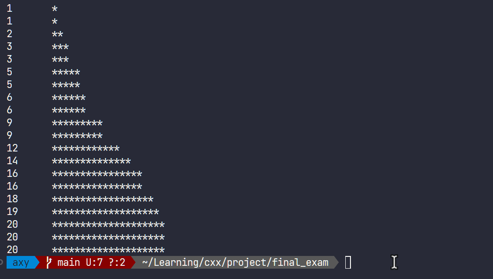

### 初始项目结构
首先，根据项目要求创建一个符合要求的项目结构。

从要求中，大致要以下几个模块：
- 数据结构`data_structures`
- 排序`sorting`
- 可视化`visualization`
- 其他工具类，如随机数生成器`utils`

根据上述模块，可以创建以下目录结构：
```
.
├── Makefile
├── README.md
├── build
├── doc
│   └── report.md
├── include
│   ├── data_structures
│   ├── sorting
│   ├── utils
│   └── visualization
├── lib
├── src
│   ├── data_structures
│   ├── main.cpp
│   ├── sorting
│   ├── utils
│   └── visualization
└── test
```
### 数据结构与排序
#### 数据结构
首先从数据结构开始，在`include/data_structures`目录下创建`array.h`文件，定义数据结构的接口。

作为一个排序算法，数组是最不可少的一个数据结构，因此首先定义数组的接口。
```cpp
#ifndef ARRAY_H
#define ARRAY_H

class Array {
public:
    Array(int size);
    ~Array();

    int getSize() const;
    int get(int index) const;
    void set(int index, int value);

private:
    int* data;
    int size;
};

#endif // ARRAY_H


```
在上面的代码中，定义了一个`Array`类，包含了数组的基本操作，如获取数组大小、获取数组元素、设置数组元素等。

之后需要实现这个类，因此在`src/data_structures`目录下创建`array.cpp`文件，实现`Array`类的接口。

由于本次项目不考虑泛型，因此数组的元素类型固定为`int`。

本项目较为复杂，为了避免命名空间冲突，不使用`using namespace std;`，而是使用`std::`前缀。
```cpp
#include "array.h"
#include <stdexcept>

Array::Array(int size) : size(size) {
    data = new int[size];
}

Array::~Array() {
    delete[] data;
}

int Array::getSize() const {
    return size;
}

int Array::get(int index) const {
    if (index < 0 || index >= size) {
        throw std::out_of_range("Index out of range");
    }
    return data[index];
}

void Array::set(int index, int value) {
    if (index < 0 || index >= size) {
        throw std::out_of_range("Index out of range");
    }
    data[index] = value;
}


```
在上面的代码中，实现了`Array`类的构造函数、析构函数、获取数组大小、获取数组元素、设置数组元素等接口。
#### 排序
接下来实现排序算法，我希望首先实现一个冒泡排序。

在`include/sorting`目录下创建`bubble_sort.h`文件，定义冒泡排序的接口。

然后在`src/sorting`目录下创建`bubble_sort.cpp`文件，实现冒泡排序的接口。

过程和上面的数据结构类似，这里不再赘述。

冒牌排序的实现如下：
```cpp
void bubbleSort(Array& array) {
    int size = array.getSize();
    for (int i = 0; i < size - 1; ++i) {
        for (int j = 0; j < size - i - 1; ++j) {
            if (array.get(j) > array.get(j + 1)) {
                int temp = array.get(j);
                array.set(j, array.get(j + 1));
                array.set(j + 1, temp);
                visualize(array);
            }
        }
    }
}

```
接下来是实现随机数填充数组的函数，这个函数在`utils`模块中。

随机数的生成使用`rand()`函数，种子使用`time(nullptr)`函数。

在`utils`目录下创建`random_generator`文件，定义随机数生成函数。
头文件和此前模块类似，源文件的核心实现如下：
```cpp
void generateRandomArray(Array& array, int minValue, int maxValue) {
    std::srand(std::time(nullptr));
    for (int i = 0; i < array.getSize(); ++i) {
        array.set(i, minValue + std::rand() % (maxValue - minValue + 1));
    }
}
```
#### 可视化
接下来需要完成可视化部分，但此时我想要先对此前的内容进行测试，先写一个简单的`std::cout`来显示的可视化。在`visualization`目录下创建`visualize`头文件和源文件。

可视化需要获取到数组的大小和数组的元素，因此`visualize`函数需要一个`Array`对象作为参数。

在排序算法的恰当时机调用`visualize`函数，即可实现可视化。根据冒泡排序的实现，可以在交换元素时调用`visualize`函数。

目前还没有引入`ncurses`库，因此只能使用`std::cout`来进行简单的可视化。
简易可视化的代码如下：
```cpp
void visualize(const Array& array) {
    system("clear"); 
    for (int i = 0; i < array.getSize(); ++i) {
        std::cout << array.get(i) << "\t";
        for (int j = 0; j < array.get(i); ++j) {
            std::cout << "*";
        }
        std::cout << std::endl;
    }
    std::this_thread::sleep_for(std::chrono::milliseconds(100));
}
```
### Makefile
现在，我们几乎有了一个完整的项目，但是还不能简单地运行起来，我们需要一个`Makefile`来编译项目。

> 模块分别使⽤静态库、动态库编译技术（即有的模块为静态编译、有的模块为动态编译）

根据上述要求，我们既需要静态库，也需要动态库。我决定将数据结构、排序和工具类编译为静态库，可视化模块可能在将来使用`ncurses`库，因此编译为动态库。

#### MakeFile 常量定义
首先定义一些常量，如编译器、编译选项、目录等。
```makefile
# Compiler and flags
CXX = g++
CXXFLAGS = -Wall -Wextra -std=c++17 $(shell find $(INCLUDE_DIR) -type d -exec echo -I{} \;)

# Directories
SRC_DIR = src
BUILD_DIR = build
LIB_DIR = lib
INCLUDE_DIR = include
TEST_DIR = test

# Libraries
STATIC_LIBS = $(LIB_DIR)/libdata_structures.a $(LIB_DIR)/libsorting.a $(LIB_DIR)/libutils.a
DYNAMIC_LIBS = $(LIB_DIR)/libvisualization.so

# Source files
SRC_FILES = $(wildcard $(SRC_DIR)/**/*.cpp) $(SRC_DIR)/main.cpp

# Object files
OBJ_FILES = $(patsubst $(SRC_DIR)/%.cpp, $(BUILD_DIR)/%.o, $(SRC_FILES))

# Target
TARGET = $(BUILD_DIR)/visualAlgo
```

#### 目标文件编译
接下来编译目标文件，将目标文件放在`build`目录下。
```makefile
$(BUILD_DIR)/%.o: $(SRC_DIR)/%.cpp
	mkdir -p $(dir $@)
	$(CXX) $(CXXFLAGS) -fPIC -c -o $@ $<
```

#### 编译动态库
接下来编译动态库，动态库只有可视化模块一个，因此只需要编译一个动态库即可。将编译出的动态库放在`lib`目录下
```makefile
# Build dynamic library
$(LIB_DIR)/libvisualization.so: $(BUILD_DIR)/visualization/visualize.o
	$(CXX) -shared -o $@ $^
```

#### 编译静态库
接下来编译静态库，共有三个静态库，分别是数据结构、排序和工具类。将编译出的静态库放在`lib`目录下。
```makefile
# Build static libraries
$(LIB_DIR)/libdata_structures.a: $(BUILD_DIR)/data_structures/array.o
	ar rcs $@ $^

$(LIB_DIR)/libsorting.a: $(BUILD_DIR)/sorting/bubble_sort.o
	ar rcs $@ $^

$(LIB_DIR)/libutils.a: $(BUILD_DIR)/utils/random_generator.o
	ar rcs $@ $^
```
#### make install
现在我们有了动态库文件和静态库文件，我们需要将这些文件安装到系统目录中，以便程序使用。
根据要求，我们需要将静态库和动态库安装到`/usr/local/lib`目录下，并根据特点指定权限。
```makefile
# Install libraries
install: $(STATIC_LIBS) $(DYNAMIC_LIBS)
	install -m 644 $(STATIC_LIBS) /usr/local/lib/
	install -m 755 $(DYNAMIC_LIBS) /usr/local/lib/
	ldconfig
```
#### 可执行文件
现在我们有了所有的组件，我们需要将这些组件链接起来，生成可执行文件。
```makefile
# Build target executable
$(TARGET): $(OBJ_FILES) $(STATIC_LIBS) $(DYNAMIC_LIBS)
	$(CXX) $(CXXFLAGS) -o $@ $(OBJ_FILES) $(STATIC_LIBS) 
```
我们把库文件安装到了标准路径，这样，在编译时就可以直接链接这些库文件，而不需要指定路径。

#### make 目标
现在已经完成了所有的编译工作，我们需要定义一些`make`目标，来简化编译过程。如`all`、`clean`、`run`等。
在`Makefile`的适当位置添加以下代码：
```makefile
all: $(TARGET)

run: $(TARGET) install
	$(TARGET)

uninstall:
	rm -f /usr/local/lib/libdata_structures.a
	rm -f /usr/local/lib/libsorting.a
	rm -f /usr/local/lib/libutils.a
	rm -f /usr/local/lib/libvisualization.so
	ldconfig

clean:
	rm -rf $(BUILD_DIR) $(LIB_DIR)/*.a $(LIB_DIR)/*.so
```
#### 测试
执行`make run`（可能需要`sudo`）即可编译并运行程序。

从上述 gif 动图（pdf版本图片不可动，请查看`1.gif`或 `doc/report.md` 报告）可以看到，程序成功运行，实现了冒泡排序的可视化。但是由于没有引入`ncurses`库，因此只能使用`std::cout`来进行简单的可视化。
### ncurses 库支持的可视化
#### 安装 ncurses

`ncurses`库安装比较简单，我从源码编译、构建和安装`ncurses`库。

```bash
wget https://invisible-island.net/datafiles/release/ncurses.tar.gz
tar -xzvf ncurses.tar.gz 
cd ncurses-6.3/
./configure 
make
sudo make install
```
#### 安装 Google Test
接下来，由于需要对`ncurses`库进行测试和学习，我引入了`Google Test`测试框架，因此需要安装`Google Test`。
```bash
 git clone https://github.com/google/googletest.git
 cd googletest
 mkdir build
 cd build/
 cmake ..
 make
 sudo make install
```
安装好`Google Test`后，需要对`Makefile`进行修改，以便能够通过`make test`来运行测试。我在`Makefile`中添加了这些内容，如下所示：

```makefile
# Test source files
TEST_SRC_FILES = $(wildcard $(TEST_DIR)/*.cpp)

TEST_TARGET = $(BUILD_DIR)/runTests

$(TEST_TARGET): $(TEST_OBJ_FILES)
	$(CXX) -o $@ $^ $(LDFLAGS) -lgtest -lgtest_main -pthread

$(BUILD_DIR)/%.o: $(TEST_DIR)/%.cpp
	mkdir -p $(dir $@)
	$(CXX) $(CXXFLAGS) -c -o $@ $<

test: $(TEST_TARGET)
	$(TEST_TARGET)

```
#### 测试 ncurses 库
处理完成相关依赖后，即可编写测试代码。先后编写了两个测试代码，一个测试`Gtest`是否成功运行，一个测试`ncurses`库是否成功运行。
下面是测试`ncurses`库的基本使用，如下所示：
```cpp
TEST(NcursesTest, Initialization) {
    initscr();			
	printw("Hello World !!!");	
	refresh();		
	getch();		
	endwin();		
}
```
执行`make test`即可运行测试，测试结果如下：
```bash
[==========] Running 2 tests from 2 test suites.
[----------] Global test environment set-up.
[----------] 1 test from GTest
[ RUN      ] GTest.Initialization
[       OK ] GTest.Initialization (0 ms)
[----------] 1 test from GTest (0 ms total)

[----------] 1 test from NcursesTest
[ RUN      ] NcursesTest.Initialization
```
通过上述测试，我们可以看到`ncurses`库成功运行，可以进行下一步的开发。

#### ncurses 可视化


